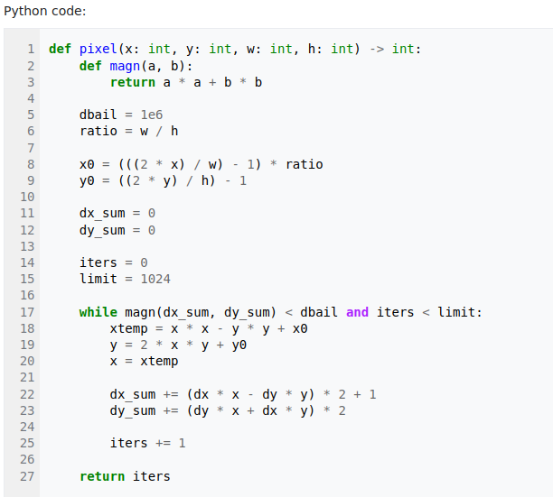
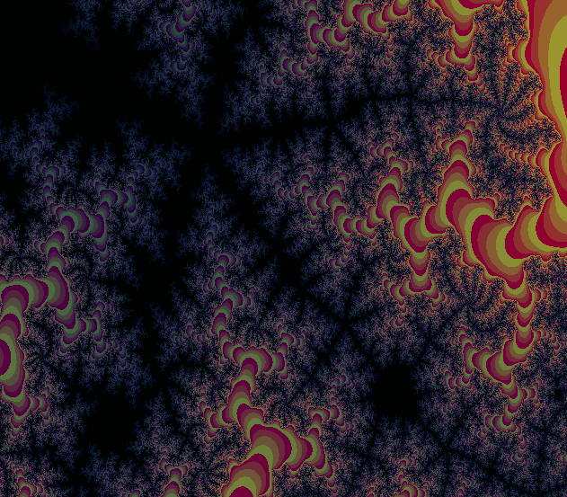
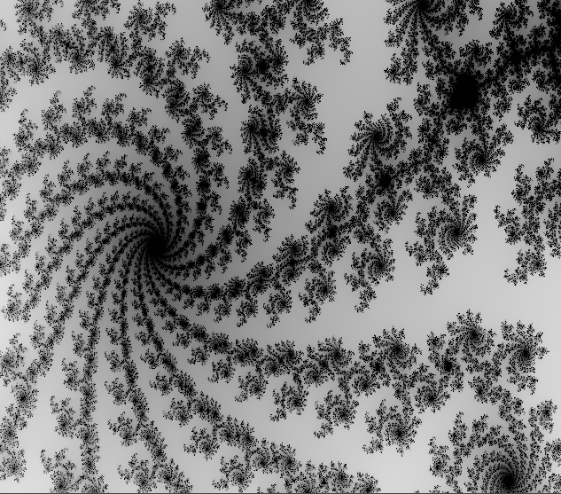
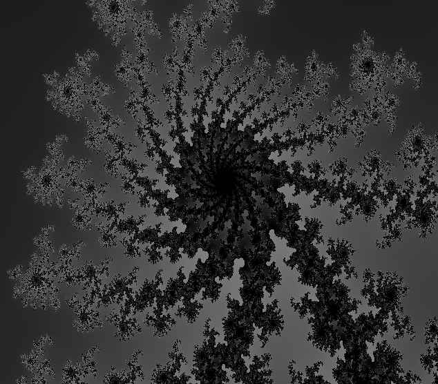
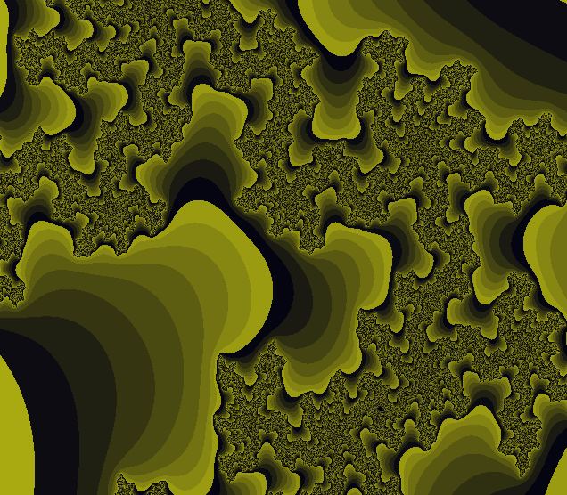

# Mandelbrot fractal optimization

## Introduction
In this work I tried to optimize algorithm of drawing Mandelbrot set by using available on my computer SIMD-instructions: AVX2 and AVX512.

## Algorithm of drawing

... this section is in progress ...

... pay us to keep up to date with updates ...

For unsubscribed users only Python algorithm available:

...

As we see, perfomance of algorithm depends on amount of pixels in resulting picture

``t ~ width * height``

Number of operating pixels in algorithm is ``640*560 = 358400``. It actually takes time to process all of them, so algorithm optimization required.

## Optimization principles
Ideas of optimization that use AVX2 and AVX512 instructions are the same.

We are able to process 8 pixels at the same time by using __m256i variables and AVX2 instructions or 16 pixels by using __m512i variables and AVX512 instructions. Here is mechanism of optimization described step-by-step.

... this section is in progress ...
... pay us to keep up to date with updates ...

## Perfomance
To evaluate and compare the speed of working algorithms I calculate fps value of 10 cycles of Alpha-Blending.

``fps = 1 / blending_time``

It's important to evaluate the time correctly, so when I do it, app don't draw anything in SFML, just operates with arrays of pixels

Evaluations made with precision ~ ``0.3 sec^(-1)``

|optimization \ flag|None    |-O0 |-O1 |-O2  |-O3      |-Ofast|
|:------------------|:------:|:--:|:--:|:--: |:-------:|:----:|
|no AVX inctructions|**2.5** |2.5 |4.5 |4.5  |4.6      |4.8   |
|                   |        |    |    |     |         |      |
|AVX2 inctructions  |**8.3** |8.3 |29.5|157.1|**157.1**|156.9 |
|abs speed increase |3.3     |3.3 |6.6 |34.9 |34.2     |32.7  |
|                   |        |    |    |     |         |      |
|AVX512 inctructions|**14.2**|14.2|44.2|155.1|156.2    |155.2 |
|abs speed increase |5.7     |5.7 |9.8 |34.5 |34.0     |32.3  |
|rel speed increase |1.7     |1.7 |1.5 |~1.0 |~1.0     |~1.0  |

In the table speed increase calculated by formula
``speed_increase = (optimization_time / no_optimization_time)`` ,
where times are taken with the same set of flags

Max speedup is **147,0/9.1 = 16.2**

## Conclusion
Thus, optimizing Mandelbrot set drawing algorithm by using AVX2 instructions, a speedup of **27.6/4.6 = 6.0** times was achieved

## Colourful examples

