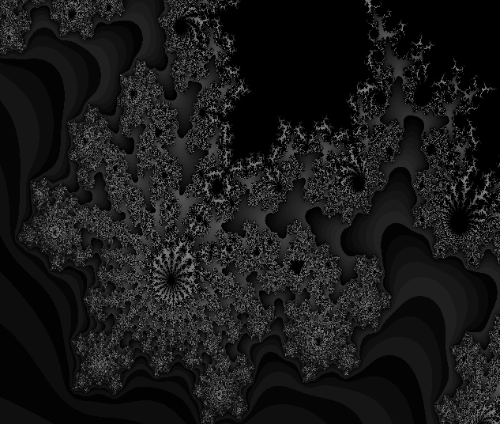
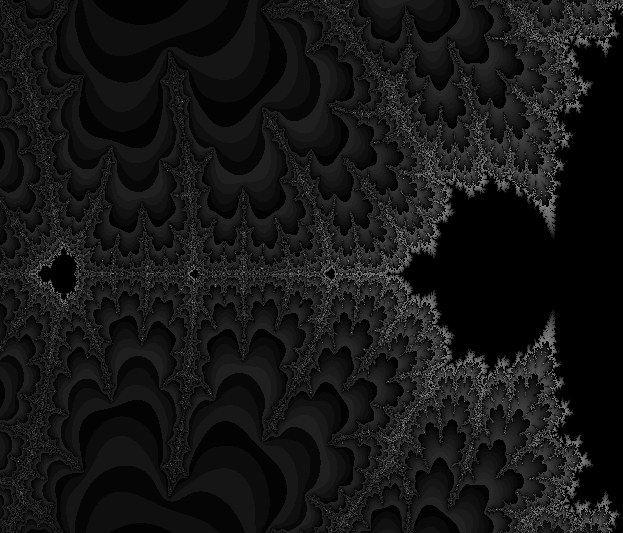
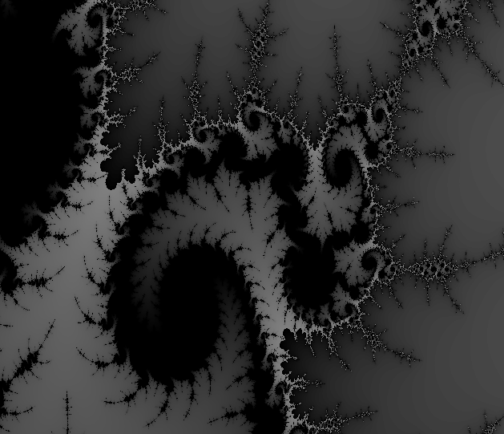

# Optimization of drawing Mandelbrot set

## Introduction
In this work I tried different ways of speeding up the Mandelbrot set calculation algorithm. For that purpose I used available on my computer SIMD-instructions: SSE, AVX2 and AVX512.

**Goals**:
- to achieve maximum speedup of the program using SIMD-instructions and optimization flags
- to measure and compare perfomances of SSE, AVX2 and AVX512 instructions
- to evaluate influence of compilation flags on the speed of the programm

## Algorithm of drawing

The Mandelbrot set is a good example of the beauty of mathematics, and there is a simple algorithm to construct it.

We take a complex plane and divide it into a finite number of points. For each of them there are a sequence of complex numbers (points):

``Z(n+1) = Z(n)+C0``, where ``C0`` is the initial point on the complex plane.

Coordinates of ``Z(n+1)`` are calculated by the rule:

``x(n+1) = x(n)^2 - y(n)^2 + X0``

``y(n+1) = 2*x(n)*y(n) + Y0``

The calculations continue until the distance from a point Z(n) to the centre of the complex plane ``(0, 0)`` calculated as ``R(n) = sqrt(x(n)^2 + y(n)^2)`` is greater than ``R_max = 2``. We run a cycle untill ``R <= R_max`` and a number of iterations ``n < 255``, so each point corresponds to a singular number ``n``.

Then, using the number of iterations ``n`` and any translating rool we calculate the components of the final pixel, which will be drawn in place of the starting point of this step of the algorithm.

As for example, there is a simple realization of the main function of the described algorithm on C:
``
    Uint8 GetIteration(float X0, float Y0)
    {
        Uint8 n_iter = 0;
        float x  = 0.0;
        float y  = 0.0;
        float x2 = 0.0;
        float y2 = 0.0;
        float xy = 0.0;
        float R  = 0.0;

        for (; R < R_max && n_iter < N_MAX; n_iter++)
        {
            x2 = x * x;
            y2 = y * y;
            xy = x * y;
            x  = x2 - y2 + X0;
            y  = xy + xy + Y0;
            R  = x*x + y*y;
        }

        return n_iter;
    }
``

As we see, perfomance of algorithm depends on amount of pixels in resulting picture

``t ~ width * height``

The number of operating pixels in algorithm is ``640*560 = 358400``. It actually takes time to process all of them alternately, so algorithm optimization required.

## Optimization principles
Ideas of optimization that use SSE, AVX2 and AVX512 instructions are the same, but they partly have some different functions that are actually lead to the same result.

We are able to process 4 pixels at the same time by using ``__m128``, ``__m128i`` variables from the SSE instruction set, 8 pixels at the same time by using ``__m256``, ``__m256i`` variables and AVX2 and finally process 16 pixels by using ``__m512``, ``__m512i`` variables and AVX512 instructions.

Basically, the algorithm is similar to the scalar case, but for the iteration counter I use a vector variable ``N``, and  to increae it after step I sum it with the result of comparing the vectors ``R`` (current distance) and ``R_max``. The result of comparing ``R`` and ``R_max`` using the ``_mm256_cmp_ps`` function (or similar) is a vector variable or mask, it depends on the SIMD-instructions set. At each iteration, it is checked that the mask is not equal to 0, because this means that the algorithm should be stopped. Then the same mask is added to the vector containing the number of iterations for each of the pixels. Before that it translated into a vector of integer values, such as ``N``. The remaining actions of the algorithm are similar to the unoptimized one, but they allows to perform actions for 4, 8 or 16 pixels at once.

Also, to make the programm readable and to use functions in optimized versions I use ``inline`` functions, that allow to split the program into logical parts, but at the same time don't interfere with the compiler in optimizing the program.

## Time measuring principles
To visualise the Mandelbrot set, I use SFML, a modern graphics library for C++. It allows you to create a graphical window of the required size and display a picture as an array of pixels. There are special data type for pixels in SFML, it called ``Color`` and it contains four ``_uint8_t``.

There is a problem of evaluating algorithm working time while it uses SFML functions. For example we don't need to include diplaying time in calculations of fps, because it is not a part of the algorithm we speeding up and it requires the use of slow SFML functions.

To evaluate the speed of working algorithms correctly, I have created 2 programms: first one for visualizing Mandelbrot set and second one only for speed measurments. To compare programms perfomances I calculate fps value of every Mandelbrot calculation in cycle. This is where the ``clock.restart()`` function from this library helped me, it updates the time counter and returns the time since its last call.

``fps = 1 / calculating_time``

An important factor that affects perfomance is also how the colour components are calculated from the resulting number of iterations for each pixel. So that this part of the drawing algorithm is not limiting, I use a simple way to convert the number of iterations into colour components for the programm that evaluates perfomance of algorithm:

``n -> RGB(n, 255, 255-n, 255)``

However, for the version of programm that draws the resulting set I use various ways of translating the number of iterations to color to get beautiful images. You can see the examples of pictures in the end of this work.

Programm that evaluates speed also calculates average value of fps for the better precision. My measurements are made with a precision about ``2%``. The experiment shows that even room temperature can be important when estimating time, so all measurements had to be taken quickly and in the same conditions to eliminate the influence of other random processes on the computer's performance.

``avg_fps = sum_fps / N_fps``

## Perfomance
Running programms with different optimization flags and evaluating their perfomances gave me data for the following table. Measurements are taken in 3 runs of the programm and all three anerage values are also averaged.

|optimization \ flag|None    |-O0 |-O1 |-O2  |-O3      |-Ofast   |
|:------------------|:------:|:--:|:--:|:--: |:-------:|:-------:|
|no AVX inctructions|**2.5** |2.5 |4.5 |4.5  |4.6      |4.8      |
|                   |        |    |    |     |         |         |
|SSE inctructions   |**4.1** |4.1 |16.9|162.7|**163.1**|163.0    |
|abs speed increase |**1.6** |1.6 |3.8 |36.2 |35.5     |34.0     |
|                   |        |    |    |     |         |         |
|AVX2 inctructions  |**8.3** |8.3 |29.5|157.1|157.1    |156.9    |
|abs speed increase |**3.3** |3.3 |6.6 |34.9 |34.2     |32.7     |
|rel speed increase |**2.1** |2.1 |1.7 |~1.0 |~1.0     |~1.0     |
|                   |        |    |    |     |         |         |
|AVX512 inctructions|**14.2**|14.2|44.2|155.1|156.2    |155.2    |
|abs speed increase |**5.7** |5.7 |9.8 |34.5 |34.0     |32.3     |
|rel speed increase |**1.7** |1.7 |1.5 |~1.0 |~1.0     |~1.0     |

In the table programm speed is given in ``fps = 1 / sec``

To compare SIMD-instructions with each other and evaluate an impact of optimization flags I calculated 2 differernt сoefficients of speed increase:
- ``abs_speed_increase = instruction_fps / no_instruction_fps``, where time periods are taken from the perfomances with the same flags set
- ``rel_speed_increase = instruction_fps / prev_instruction_fps``, where time periods are also taken from the perfomances with the same flags set

The absolute coefficients are used to compare a perfomence of program with and without an AVX or SSE instruction. The relative coefficients are used to compare SSE, AVX2 and AVX512 instructions with each other.

The impact of the optimization flags can be seen directly from the resulting table.

To evaluate maximum speed up of the algorithm achieved in this work I use the following coefficient
``max_speed_increase = (max_fps / no_optimizations_fps)``

## Conclusions

- The main goal of the work has been achieved: I sped up the algorithm's work as many times as possible, experiment shows that is about **163.1/2.5 = 65.2** times. It is also interesting that, formally, the maximum speed of the program showed flag ``-03`` when using SSE instructions. In fact, speeds of programms using SSE, AVX2 and AVX512 instructions and compilation flags ``-02``, ``-03``, ``-Ofast``, as we see from table are very similar, and differences between instructions may be related to measurement error. However, the perfomances of programms using and not using intrinsics on the same flags are already very different. From the table we see that this difference is about **33** times!

- As it expected, the algorithm works faster when it use SIMD instructions. To evaluate the contribution of these instructions, consider the first or column of the table in which the program worked without optimization flags or with the ``-O0`` flag. Accelerations of **1.6**, **3.3**, **5.7** times corresponding to the unoptimized version were achieved using SSE, SSE2 and AVX 512 instructions. Comparing these SIMD-instructions with each other, the algorithm working with AVX2 was **2.1** times faster than SE, and AVX512 sped up the previous version by **1.7** times. These data justify the use of such instructions as AVX512 in optimizing the work of programs, because even without the efforts of the compiler, you can achieve an speeding up of the algorithm by almost **6** times! Unfortunately, only newer models of Intel processors support AVX512, so for those who do not have the opportunity to use them may use AVX2, which many processors already have.

- Evaluating the impact of the compilation flags on the programms perfomances, the table shows that on powerful flags ``-O2``, ``-O3``, ``-Ofast`` the acceleration is the most significant and it is about **40**, **19**, **27** times compared to programs without flags, but using same SSE, AVX2, AVX512 SIMD-instructions. At the same time, their impacts don't differ so much from each other. The work of programms with the ``-O1`` flag is already very different, when using it speed increases about **3-4** times comparing to programms with the same SIMD-instructions but without optimization flags.

## Colourful examples

... pay us to keep up to date with updates ...

For unsubscribed users only English version of the description available.

... pay us to keep up to date with updates ...
